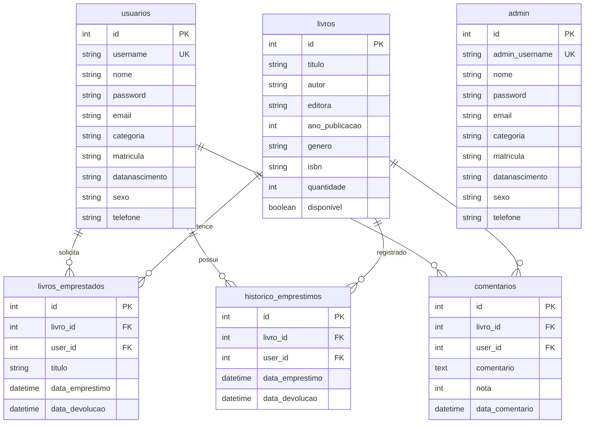

# 📚 Leitores de Papel — IFBA Ilhéus

<div align="center">


<p align="center">
  <strong>Plataforma Web para Gestão de Acervo Bibliotecário, Empréstimos, Devoluções e Incentivo à Leitura</strong>
</p>

[Sobre o Projeto](#-sobre-o-projeto) •
[Funcionalidades](#-funcionalidades) •
[Arquitetura e Módulos](#-arquitetura-e-módulos) •
[Segurança](#-segurança-e-auditoria-owasp) •
[Banco de Dados](#-estrutura-do-banco-de-dados) •
[Instalação](#-como-rodar-localmente) •
[Equipe](#-equipe-e-créditos)

</div>

---

## ✨ Sobre o Projeto

O **Leitores de Papel** é um sistema web desenvolvido como projeto acadêmico no **IFBA — Instituto Federal da Bahia, campus Ilhéus**, idealizado por **Alan Prates** e **Daniel Monteiro**.

O sistema foi projetado para modernizar o controle de acervo e fluxo de empréstimos da biblioteca, substituindo controles manuais por uma plataforma digital segura, ágil e responsiva. Além da operação bibliotecária (cadastro de livros, controle de estoque, prazos de devolução e relatórios), a aplicação estimula o engajamento dos leitores por meio de resenhas e avaliações com notas por estrelas.

---

## 🚀 Funcionalidades

### 📖 Para os Alunos e Leitores (`/user`)
- **Painel do Leitor**: Acesso rápido a livros disponíveis, histórico de leituras e devoluções.
- **Catálogo de Acervo Completo**: Busca dinâmica por título, autor, ano de publicação, disponibilidade e ordenação alfabética.
- **Solicitação de Empréstimos**: Reserva e retirada imediata de livros com cálculo automático de prazo.
- **Devolução com Resenha**: Devolução de exemplares acompanhada de comentário e nota (1 a 5 estrelas) exibida em formato visual dourado (`★`).
- **Histórico Completo**: Visualização de todos os empréstimos anteriores com datas formatadas no padrão brasileiro (`d/m/Y H:i`).
- **Minhas Leituras Ativas**: Painel com acompanhamento em tempo real dos livros em posse do aluno e botão de devolução direta.
- **Comunidade e Opiniões**: Mural comunitário com todas as resenhas e comentários da biblioteca.
- **Atualização de Cadastro**: Alteração de e-mail, telefone, categoria e senha protegida por bcrypt.

### 🛡️ Para a Administração e Bibliotecários (`/admin`)
- **Painel Administrativo Geral**: Indicadores consolidados de livros, usuários e empréstimos ativos.
- **Gestão de Acervo (CRUD de Livros)**:
  - Cadastro de livros com ISBN, título, autor, editora, ano, gênero e estoque inicial.
  - Edição de títulos com validação de disponibilidade automática ao zerar a quantidade.
  - Exclusão com proteção em cascata de integridade referencial.
- **Gestão de Empréstimos e Devoluções**: Baixa manual de devoluções com sincronização em lote de estoque.
- **Relatório Analítico de Empréstimos**:
  - Filtro por número de matrícula do aluno.
  - Filtro por intervalo de datas (Início e Fim).
  - Opção de listagem geral com badges de status (*Devolvido* ou *Pendente*).
- **Gestão de Usuários**: Listagem completa de leitores com status, contatos e filtros de busca.
- **Gestão de Administradores**: Criação de contas de superusuário com verificação assíncrona de duplicidade e termos de responsabilidade.
- **Moderação de Avaliações**: Visualização e auditoria das resenhas publicadas pela comunidade.
- **Central de Notificações**: Alertas sobre devoluções em atraso.

### 🌐 Área Pública e Autenticação (`/public`)
- **Página de Login Unificada**: Login com direcionamento automático via RBAC (*Role-Based Access Control*) para a área correspondente.
- **Cadastro de Leitores**: Formulário multi-coluna com ícones, verificação de nome de usuário em tempo real e aceite de regulamento.
- **Recuperação de Senha**: Envio de instruções por e-mail institucional via PHPMailer com geração de token seguro.

---

## 🏗️ Arquitetura e Módulos

O projeto adota uma arquitetura modular estruturada em camadas bem definidas:

```
Leitores-de-papel-ifba-Ilheus/
├── actions/                  # Controladores de regras de negócio e processamento POST
│   ├── login.php             # Autenticação e inicialização de sessão segura
│   ├── logout.php            # Destruição de sessão e limpeza de cookies
│   ├── salvar_livro.php      # Inclusão e validação de novos livros no banco
│   ├── atualizar_livro.php   # Atualização cadastral de exemplares
│   ├── devolve_livro_action.php # Processamento de devolução e salvamento de resenha
│   └── salvar_comentario_action.php # Registro de comentários e notas
├── admin/                    # Módulo do Painel Administrativo (RBAC: require_admin)
│   ├── index.php             # Dashboard gerencial
│   ├── lista_livros.php      # Tabela responsiva de livros com filtros e paginação
│   ├── cadastro_livro.php    # Formulário em card para novos títulos
│   ├── editar_livro.php      # Edição de livros e controle de estoque
│   ├── excluir_livro.php     # Exclusão segura com verificação de chaves estrangeiras
│   ├── informacoes_usuarios.php # Relatório avançado de empréstimos
│   ├── lista_usuarios.php    # Tabela gerencial de leitores
│   ├── lista.php             # Relação de administradores cadastrados
│   ├── cadastro.php          # Cadastro de novos administradores
│   └── devolve_livro.php     # Controle administrativo de devoluções
├── user/                     # Módulo do Leitor / Aluno (RBAC: require_login)
│   ├── aluno.php             # Dashboard principal do estudante
│   ├── lista_livros.php      # Catálogo com filtros de pesquisa e solicitação de empréstimo
│   ├── empresta_livro.php    # Confirmação de empréstimo e decremento de acervo
│   ├── devolve_livro.php     # Devolução de livro com card de estrelas (★)
│   ├── minhas_leituras.php   # Empréstimos ativos em posse do usuário
│   ├── historicos_emprestimos.php # Histórico cronológico de devoluções
│   └── atualiza_dados.php    # Edição do perfil e redefinição de senha
├── public/                   # Módulo de Acesso Público
│   ├── index.php             # Portal de login moderno com card centralizado
│   ├── cadastro.php          # Auto-cadastro de novos estudantes
│   └── recuperar_senha.php   # Recuperação de credenciais via e-mail
├── config/                   # Configurações do ambiente
│   └── database.php          # Conexão MySQLi com suporte a charset UTF-8 e timezone
├── includes/                 # Componentes compartilhados
│   ├── auth.php              # Guardiões de segurança (require_login, require_admin)
│   ├── header.php            # Navbar responsiva com exibição dinâmica do usuário
│   ├── footer.php            # Rodapé institucional unificado
│   └── mail_config.php       # Parâmetros de transporte SMTP para PHPMailer
├── assets/                   # Recursos estáticos
│   ├── css/                  # Estilos globais (style.css, bootstrap, menu-mobile)
│   └── js/                   # Validações assíncronas, máscaras e alternância de senha
├── docs/                     # Documentação de engenharia e auditoria
│   ├── security-audit/       # Relatório de vulnerabilidades OWASP mitigadas (PDF + scripts)
│   └── screenshots/          # Capturas de tela e evidências visuais
└── setup_database_full.php   # Script de provisionamento e seed inicial do banco
```

---

## 🔒 Segurança e Auditoria OWASP

O código passou por rigoroso processo de auditoria de segurança baseado no guia **OWASP Top 10**, recebendo correções profundas em 5 pilares críticos:

1. **Prevenção contra SQL Injection (SQLi)**:
   - Todas as operações de leitura, inserção, atualização e exclusão foram convertidas para **Prepared Statements** parametrizados com a extensão MySQLi (`$stmt->prepare()` e `$stmt->bind_param()`), eliminando concatenações inseguras de strings.
2. **Controle de Acesso Baseado em Papéis (RBAC)**:
   - Funções centralizadas em [includes/auth.php](file:///Applications/MAMP/htdocs/Leitores-de-papel-ifba-Ilheus/includes/auth.php):
     - `require_login()`: Garante que apenas usuários autenticados acessem rotas internas.
     - `require_admin()`: Bloqueia qualquer tentativa de elevação de privilégios de alunos comuns para endpoints administrativos.
3. **Isolamento de Dados (Tenant / Ownership Isolation)**:
   - Ações de devolução de livro e consulta de histórico em `/user/` utilizam o `$_SESSION['user_id']` validado no servidor, impedindo que um aluno visualize ou devolva empréstimos pertencentes a outro colega via alteração de parâmetros na URL.
4. **Armazenamento Seguro de Credenciais**:
   - Todas as senhas de usuários e administradores são criptografadas com **Bcrypt** por meio da função nativa `password_hash($senha, PASSWORD_DEFAULT)` e validadas via `password_verify()`.
5. **Mitigação contra Cross-Site Scripting (XSS)**:
   - Todas as saídas de dados provenientes do banco de dados ou de parâmetros da URL (`$_GET` / `$_POST`) são escapadas com `htmlspecialchars($valor, ENT_QUOTES, 'UTF-8')`.

> [!NOTE]
> O relatório formal com gráficos de severidade e histórico de correções está arquivado em [docs/security-audit/relatorio-auditoria-seguranca.pdf](file:///Applications/MAMP/htdocs/Leitores-de-papel-ifba-Ilheus/docs/security-audit/relatorio-auditoria-seguranca.pdf).

---

## 🗄️ Estrutura do Banco de Dados

O banco de dados relacional foi modelado para garantir integridade referencial com chaves estrangeiras (`FOREIGN KEY`):



---

## 🎨 Design System e Responsividade

Todas as páginas do sistema seguem uma identidade visual uniforme, limpa e moderna:
- **Design Baseado em Cards**: Containers centralizados com bordas sutis (`#e2e8f0`), sombras suaves e cantos arredondados de `10px` a `14px`.
- **Cabeçalhos Expressivos**: Avatares temáticos com gradientes suaves (ex.: `<i class="fa fa-book-reader"></i>`, `<i class="fa fa-user-shield"></i>`).
- **Formulários Estruturados em Grids**: Campos organizados em colunas proporcionais (2 e 3 colunas em telas amplas e empilhamento fluido em dispositivos móveis).
- **Ícones em Todos os Inputs**: Componentes `input-group` com prefixos do FontAwesome para leitura ágil.
- **Interatividade em Tempo Real**:
  - Botão de alternância para visualização de senhas (`fa-eye` / `fa-eye-slash`).
  - Checagem automática e feedback visual instantâneo na confirmação de senhas.
  - Validação assíncrona (AJAX) para disponibilidade de novos logins.
- **Tabelas com Badges e Scroll Horizontal**: Badges coloridos indicando disponibilidade (*Disponível/Esgotado*), status de devolução (*Devolvido/Pendente*) e notas em estrelas douradas (`★`).

---

## 🚀 Como Rodar Localmente

### Pré-requisitos
- **PHP**: Versão 7.4 ou superior (testado e otimizado para PHP 8.2).
- **Banco de Dados**: MySQL 5.7+ ou MariaDB 10.3+.
- **Servidor Web**: Apache (MAMP, XAMPP, WampServer ou PHP Built-in Server).

### Passo a Passo

1. **Clone o repositório:**
   ```bash
   git clone https://github.com/AlanPrates/Leitores-de-papel-ifba-Ilheus.git
   cd Leitores-de-papel-ifba-Ilheus
   ```

2. **Configure a Conexão com o Banco de Dados:**
   - Abra o arquivo [config/database.php](file:///Applications/MAMP/htdocs/Leitores-de-papel-ifba-Ilheus/config/database.php) e ajuste suas credenciais conforme o seu ambiente:
   ```php
   $servidor = "localhost";
   $usuario  = "root";
   $senha    = "root"; // ou vazio "" no XAMPP
   $banco    = "leitores-de-papel";
   $porta    = 8889;   // ou 3306 padrão
   ```

3. **Inicialize o Banco de Dados:**
   - Execute o script automatizado de setup via terminal:
   ```bash
   php setup_database_full.php
   ```
   - Ou importe a estrutura no seu cliente MySQL preferido (phpMyAdmin, DBeaver ou MySQL Workbench).

4. **Inicie o Servidor:**
   - Se estiver usando o **PHP Built-in Server**:
     ```bash
     php -S localhost:8888
     ```
   - Se estiver usando o **MAMP / XAMPP**: Coloque o diretório dentro da pasta `htdocs` e acesse pelo navegador:
     `http://localhost:8888/public/index.php` ou `http://localhost/Leitores-de-papel-ifba-Ilheus/public/index.php`

---

## 🔑 Credenciais Padrão de Acesso

Após a execução do script `setup_database_full.php`, o sistema disponibiliza os seguintes acessos iniciais para teste:

| Tipo | Usuário | Senha Padrão | Painel |
|---|---|---|---|
| **Administrador** | `admin` | `admin` | `/admin/index.php` |
| **Leitor / Aluno** | Crie uma conta pelo botão **"Criar Nova Conta"** | Definida no cadastro | `/user/aluno.php` |

---

## 🏗️ Equipe e Créditos

| Desenvolvedor | Papel | Contato / Redes |
|---|---|---|
| **Alan Prates** | Autor e Desenvolvedor Principal | [GitHub](https://github.com/AlanPrates) • [Website](https://www.marketplaceprates.com.br) |
| **Daniel Monteiro** | Coautor e Colaborador | Contribuidor acadêmico |

### 🏫 Instituição de Ensino
Projeto desenvolvido no âmbito do **IFBA — Instituto Federal de Educação, Ciência e Tecnologia da Bahia**, Campus Ilhéus.

---

<div align="center">
  <sub>Desenvolvido com dedicação para promover a leitura e a cultura no IFBA Ilhéus. ⭐ Se este repositório foi útil para seus estudos ou projetos, deixe uma estrela!</sub>
</div>
